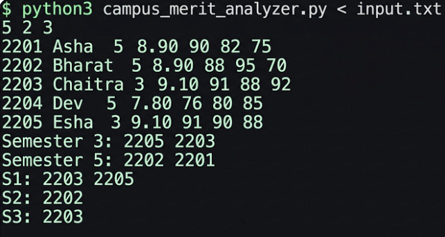
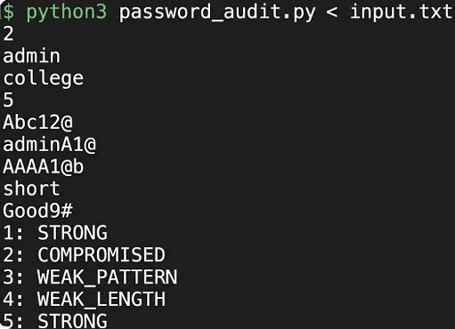
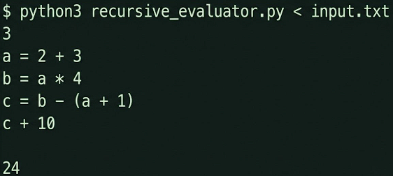
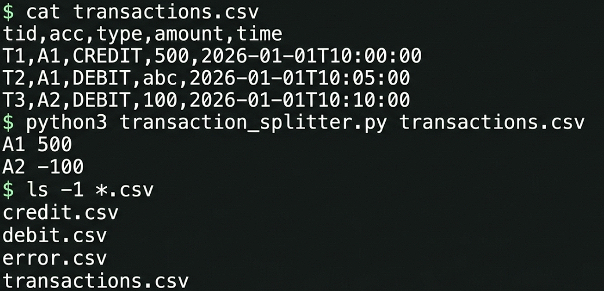
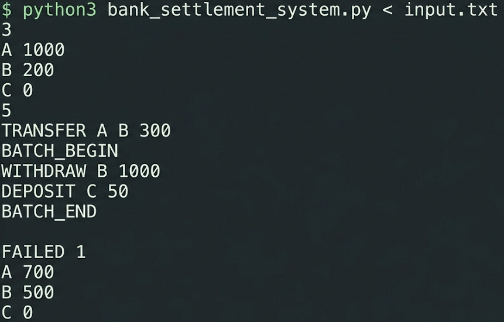
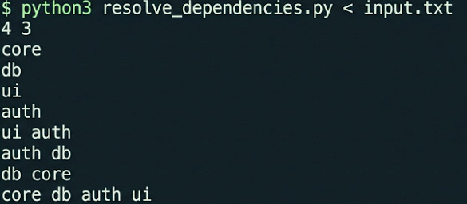
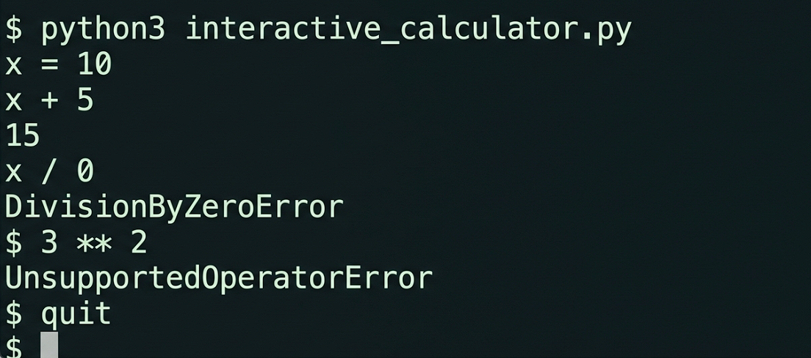
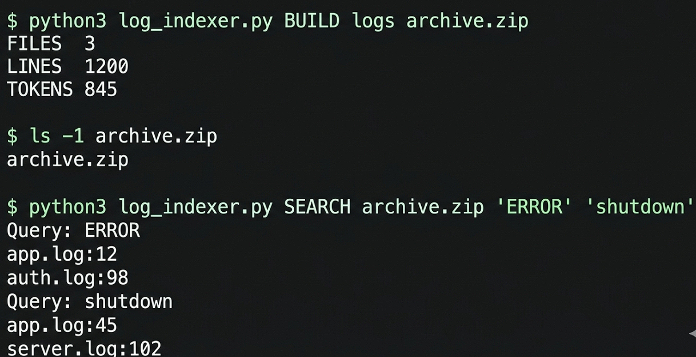
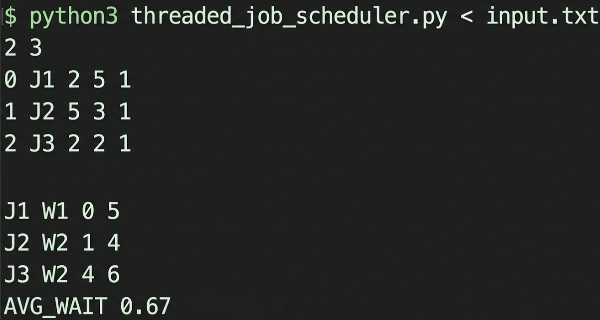
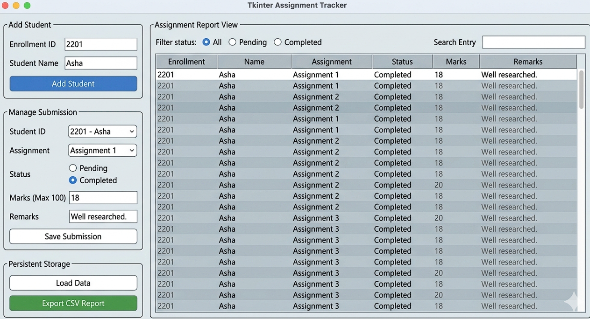

# 💻 Advanced Python Programming Repository

<p align="left">
  
  
  
</p>

---

## 👤 Scholar Profile
```git
┌───────────────────┬──────────────────────────────────┐
│ Profile Property  │ Administrative Value             │
├───────────────────┼──────────────────────────────────┤
│ Student Name      │ Mauli Patel                      │
│ Enrollment No     │ 12502080603011                   │
│ Current Term      │ Semester 5                       │
│ Academic Cycle    │ 2026 - 2027                      │
└───────────────────┴──────────────────────────────────┘
```

---

## ⚡ Core Computational Frameworks
This repository tracks 10 complex software engineering problems optimized across shared runtime metrics. Key technical pillars include:

*   **Algorithmic Optimization:** High-frequency substring lookups utilizing *Aho-Corasick Deterministic Finite Automata* to prevent processing choke points.
*   **Data Integrity Systems:** Multi-account banking ledgers utilizing *memento rollback mechanisms* to protect structural atomic transitions.
*   **State Machine Engineering:** Grammar evaluators built around *recursive descent parsing blocks* featuring loop dependency resolution layers.
*   **Desktop UI Architecture:** Form tracking environments using *virtual Treeview mappings* to handle thousands of entities without system latency.

---

## 📑 Core Program Index

### 📂 Problem Set 01 to 05

#### 🔹 Program 1: Campus Merit Analyzer
*   **Focus Area:** Grouped Data Partitioning & Custom Sorting Keys
*   **Tie Resolution:** Decoupled levels validating CPI scores \(\rightarrow\) Average Grade Metrics \(\rightarrow\) Lexicographical Registration Sequences.
<p align="left"></p>

#### 🔹 Program 2: Optimized Password Auditor
*   **Focus Area:** Text Pattern Verification & String Token Scanning
*   **Core Mechanics:** Linear processing runs evaluating constraints against automated dictionary tries to prevent scale time timeouts.
<p align="left"></p>

#### 🔹 Program 3: Recursive Expression Engine
*   **Focus Area:** Variable Reference Mappings & Mathematical Compilation
*   **Features:** Memoized cache storage to avoid recalculations alongside strict recursive dependency trackers.
<p align="left"></p>

#### 🔹 Program 4: Exception-Safe CSV Splitter
*   **Focus Area:** File Buffering Streams & Isolation Log Pipelines
*   **System Recovery:** Try-except catching networks writing corrupted lines out to error files without breaking master execution paths.
<p align="left"></p>

#### 🔹 Program 5: Object-Oriented Settlement Engine
*   **Focus Area:** Encapsulated Bank Objects & Transaction Atomicity
*   **Rollback Engine:** Memory state trackers capturing balance values to restore account records if single batch parts throw exceptions.
<p align="left"></p>

---

### 📂 Problem Set 06 to 10

#### 🔹 Program 6: Module Dependency Resolver
*   **Focus Area:** Directed Acyclic Graphs (DAG) & Topological Sorting
*   **Tie Resolution:** Kahn’s Priority Queue system mapping dependency constraints while selecting lexicographically smaller names first.
<p align="left"></p>

#### 🔹 Program 7: Interactive Formula Validator
*   **Focus Area:** Command Shell UI Loops & Custom Exception Classes
*   **Design Pattern:** Isolated input intercept structures filtering structural runtime data formatting anomalies.
<p align="left"></p>

#### 🔹 Program 8: Compressed Log Indexer
*   **Focus Area:** Inverted Index Mappings & Storage Architecture
*   **Execution:** Scans folder footprints, serializes matching line numbers to pickle files, and packs items inside compressed zip files.
<p align="left"></p>

#### 🔹 Program 9: Threaded Job Scheduler Simulation
*   **Focus Area:** Discrete-Event Simulators & Priority Queue Schedulers
*   **Core Engine:** Balanced min-heaps tracking worker state tracks and ready jobs to simulate parallel systems cleanly.
<p align="left"></p>

#### 🔹 Program 10: Tkinter Tracker & File Persistence
*   **Focus Area:** GUI Event Handlers & Data Persistence Layers
*   **Data Tier:** Local storage backed by JSON database mappings alongside responsive search field index filters.
<p align="left"></p>

---

## 📁 Repository Structure
```text
Python-Programming-Assignment/
│
├── ASS-1/
│   ├── p1.py         # Campus Merit Analyzer Engine
│   ├── p2.py         # Aho-Corasick Password Auditor
│   ├── p3.py         # Recursive Stack Expression Parser
│   ├── p4.py         # Exception-Safe CSV Splitter Stream
│   ├── p5.py         # Atomic Transaction Settlement Bank
│   ├── p6.py         # Kahn's Priority Topological Graph Resolver
│   ├── p7.py         # Custom Exception Interactive Calculator
│   ├── p8.py         # Inverted Index Pickle/Zip Pipeline
│   ├── p9.py         # Event-Driven Heaped Scheduler Simulator
│   ├── p10.py        # Optimized Tkinter GUI Management Client
│   │
│   ├── op1.png       # Program 1 Output Capture
│   ├── op2.png       # Program 2 Output Capture
│   ├── op3.png       # Program 3 Output Capture
│   ├── op4.png       # Program 4 Output Capture
│   ├── op5.png       # Program 5 Output Capture
│   ├── op6.png       # Program 6 Output Capture
│   ├── op7.png       # Program 7 Output Capture
│   ├── op8.png       # Program 8 Output Capture
│   ├── op9.png       # Program 9 Output Capture
│   └── op10.png      # Program 10 Output Capture
│
└── README.md         # Repository Documentation
```
